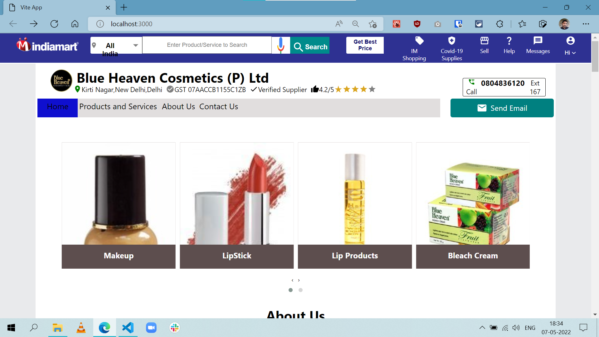
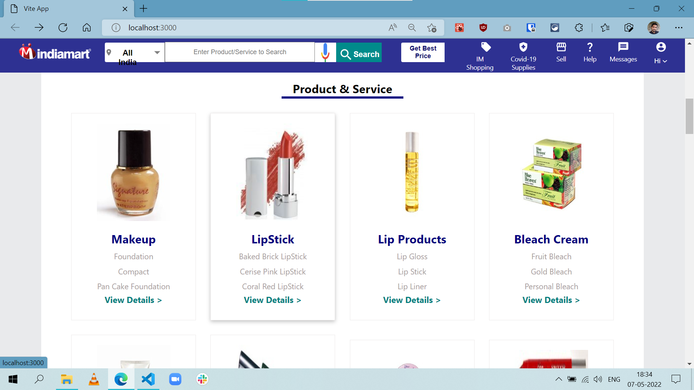
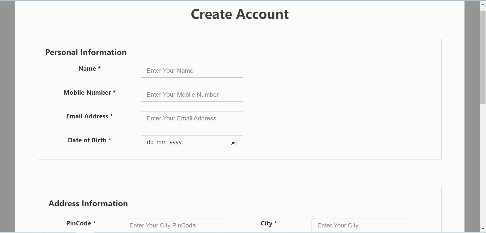
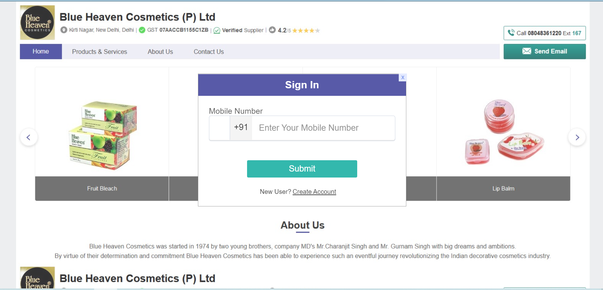
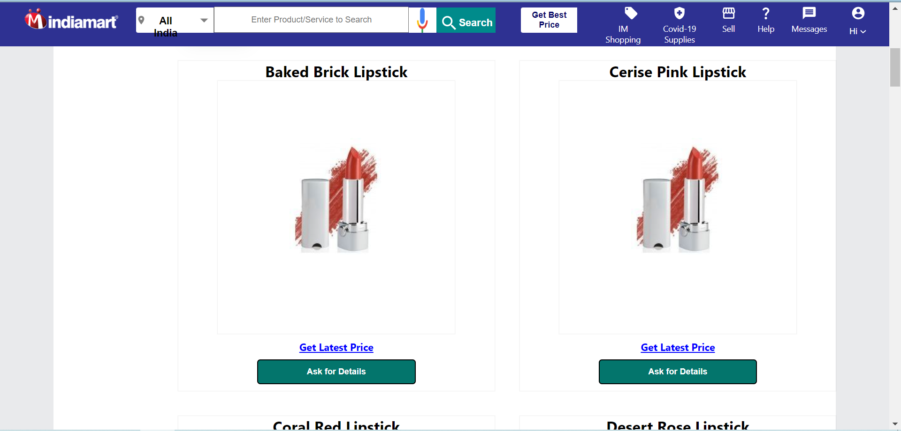
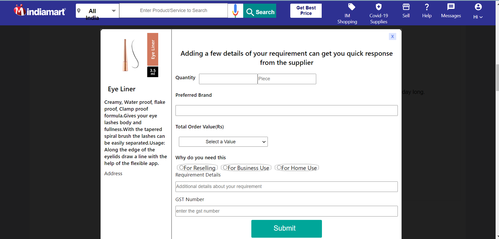
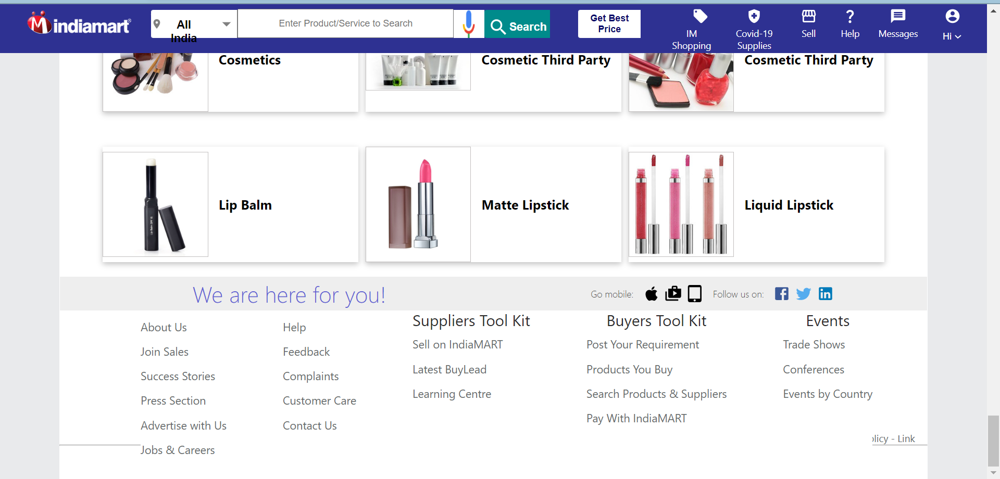

# IndiaMart Clone

## Introduction :

This project is the clone of india ecommerrce website called IndiaMart featureing Blue Heaven Cosmetics in this project. It has variety of products related to cosmetics like makeup, scrubs, lipsticks and many more realted to life style.

[Deploy Link](https://heroic-zabaione-a1a115.netlify.app/)

[Blog Link](https://medium.com/@chiramanasrikanth265/cloning-the-india-mart-website-using-mern-stack-2128484a3964)

## Technologies :

• ReactJS

• Redux

• NodeJS

• ExpressJS

• MongoDB

## Dependencies :

### Frontend:

• redux

• react-redux

• redux-thunk

• react-router-dom

• sytled-components

• material-ui

• material-ui/icons

• framer-motion

• js-cookie

• emotion

• react-owl-carousel

### Backend:

• express

• mongoose

• jsonwebtoken

• cors

• dotenv

• bcrypt

## Features :

• Landing page

• Register

• Signin

• Products Page

• Product Ordering page

## How to run project locally :

• Clone the repo locally (git clone https://github.com/Sagar160301/IndiaMart.git)

• Navigate to Frontend and Backend folder one after another and use npm install command to install required dependencies (cd Frontend, cd Backend, npm install)

• Then use command npm run dev from Frontend folder, and npm run server from Backend folder.

## some pictures of the website :

Landing page:

Categories section in landing page:

Register Page:

Signin Page:

Products Page:

Product Order page:

Footer :

